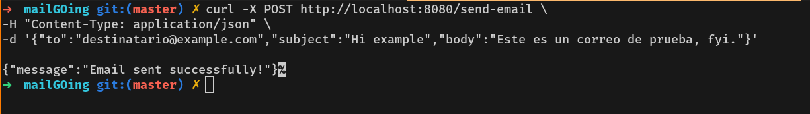

# MailGOing
### Requisitos

This its just the second project of a serie that belong my portfolio.
Here the requirement in spanish coz its my prefer lang.

- [x] Recibir solicitudes de envio de correo atraves de un api
- [x] Enviar correos utilizando un proveedor de SMTP (gmail,mailgun)
- [ ] Reintentar envios fallidos auto.
- [ ] Mantener registro de correos enviados y fallidos.

Usage:
```sh
curl -X POST http://localhost:8080/send-email \                   
-H "Content-Type: application/json" \
-d '{"to":"destinatario@gmail.com","subject":"Hola","body":"Este es un correo de prueba"}'
```

Example:
